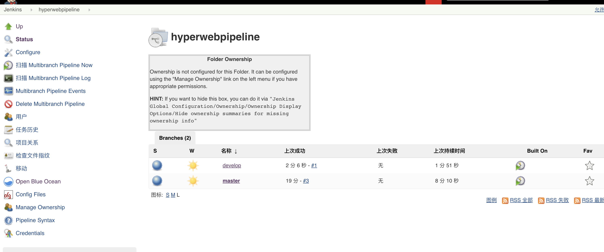
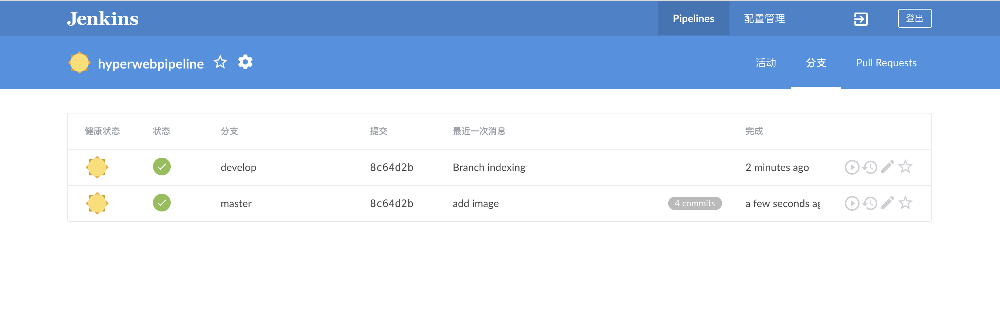
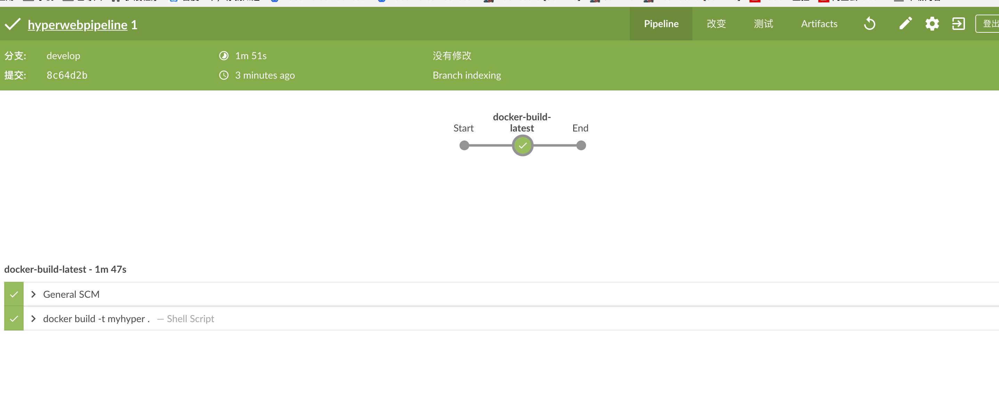
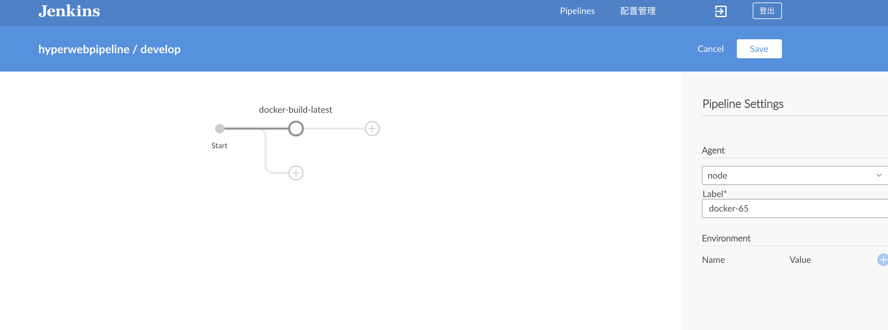

# hyper rust web framework demo

 <br>
 <br>
 <br>
 <br>

## with docker build
```bash
docker build -t myhyper .
```
## jenkins ci/cd
> project add jenkinsfile pipeline with blue ocean 

> can auto build

```bash
pipeline {
  agent {
    node {
      label 'docker-65' // change this for your jenkins cluster
    }
    
  }
  stages {
    stage('docker-build-latest') {
      steps {
        sh 'docker build -t myhyper .' //because use docker build stage docker must with docker-ce-17 
      }
    }
  }
}

```

## run
```bash
docker run -d -p 3000:3000 myhyper
```
## view result
```bash
http://dockerhost:3000
```